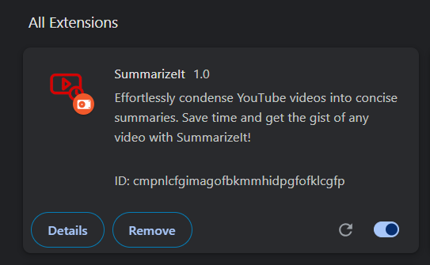

# SummarizeIt     
 
                     


## Overview

SummarizeIt is a Chrome extension designed to condense YouTube videos into concise summaries. This tool helps users save time by providing the gist of any YouTube video through a simple click of a button.

## Features

- **Easy Summarization**: Quickly generate summaries for YouTube videos.
- **User-Friendly Interface**: Simple and intuitive popup for easy interaction.
- **Real-Time Summaries**: Summaries generated on the fly using advanced AI models.

## Load the Extension in Chrome

1. Open Chrome and navigate to `chrome://extensions/`.
2. Enable `Developer mode` in the top right corner.
3. Click `Load unpacked` and select the `SummarizeIt` directory.

## Installation

### Prerequisites

- [Python 3.8+](https://www.python.org/downloads/)
- [pip](https://pip.pypa.io/en/stable/installation/)
- [Google Chrome](https://www.google.com/chrome/)

### Required Python Packages

Install the necessary Python packages using the following command:

```bash
pip install flask youtube_transcript_api transformers torch

